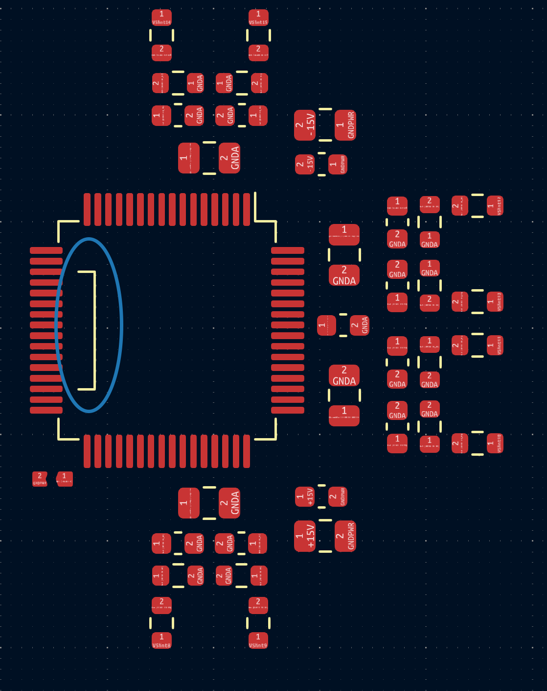

# FEAR-Mainboard
This repository contains the KiCAD-design files of the F(ield) E(mission) A(rray) R(egulation) current control circuit board.

Note: This project is part of the SubModule-repository [FE-FEAR16v2][FE-FEAR16v2-SubmoduleRepo], where you can find sub-repositories for shield-PCBs and the firmware.

# Description
The board has two areas. A low-voltage side (5V USB for computer connection, top left) which is galvanically isolated up to 1500V from the high voltage side (rest of the PCB).

The board uses a USB-C jack on the low-voltage side of the board for communication. The USB-C can also be used as AC power supply, but for this, a USB-Hub with an AC-power adapter is recommended (depending on the amount of shields and their power-use). Alternatively, a 12V screw-terminal is added as option for an external 12V AC power supply. The option if 5V USB or 12V external supply is selected by a solder-jumper. (Note: +5V or +12V needs different DCDC converter types for the +-15V supply voltage on the high-voltage side!)

The board communicates via USB by providing a virtual COM-Port on the computer. The serial connection from the FT232 for board-internal communication is transferred from the low-voltage side to the high-voltage side via optocouplers and there connected to a TIVA-Launchpad, providing the microcontroller (µC). The Launchpad runs a terminal where you can query different commands e.g. querying measurement values, etc. The µC uses SPI connections for the ADCs and DACs.

ADCs and DACs have different supplies for logic (digital signals) and references (analog) and provide 2 ADC-inputs (VShnt0..15 and VDrp0..15) for measurements and 1x DAC-output (DAC0..15) for controls to each of the shields. Each ADC and DAC has only 8 inputs. Therefore, 2 of them each can be daisy-chained together to achieve 16 in-/outputs for VShnt, VDrp and DAC.

The ADC and DAC range is by default &pm;10V. However, the ranges can be adjusted within the firmware in the ADC/DAC-wrapper sourcecodes.

# Firmware
The board-firmware can be found in the [FE-FEAR16v2 Submodule-Repo][FE-FEAR16v2-SubmoduleRepo] and needs to be flashed onto the µC of the LaunchPad. Instructions and command-documentation can be found in the firmware-repository.

# Daisy-Chains
ADCs and DACs only have 8 In-/Outputs per chip. For enough In-/Outputs for up to 16 shields, 2 ADCs or DACs can be daisy-chained together. 1 and 2 chips per ADC- and DAC-chain were tested. When using only 1 chip per ADC-/DAC-chain, the MISO (SPI data in) and MOSI (SPI data out) pins of the empty ADC-footprint needs to be shorted. The connection is indicated by the silk-screen:

The firmware handles this via software defines (described in the firmware-repository).

[FE-FEAR16v2-SubmoduleRepo]: https://github.com/Dephrilibrium/FE-FEAR16v2